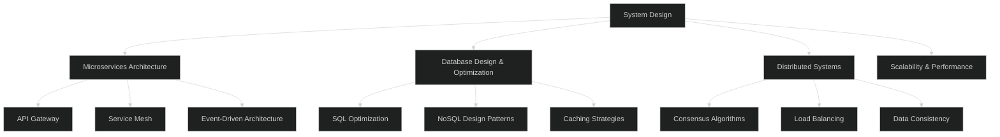

<div align="center">

# 🚀 Welcome to My Digital World! 🚀

[](https://git.io/typing-svg)

<p>
  
  
</p>

</div>

## 👨‍💻 About Me

```typescript
const jeetKarena = {
  education: " CS @ Darshan University",
  role: "Software Engineer | Full-Stack Developer | System Designer",
  currentFocus: [
    "Distributed Systems & Microservices Architecture",
    "Home Lab Infrastructure & Kubernetes Orchestration",
    "Competitive Programming with Rust",
    "System Design & Database Optimization"
  ],
  passions: [
    "Building scalable web applications",
    "Exploring distributed computing",
    "Home lab experimentation",
    "Contributing to open source"
  ],
  currentlyLearning: ["Advanced System Design", "ML Engineering", "Cloud-Native Technologies"],
  motto: "Code with purpose, build with passion, scale with precision",
};
```

## 🛠️ Tech Stack & Expertise

<div align="center">

### 🌐 Frontend Development
<p>
  
  
</p>

### ⚡ Backend & Runtime
<p>
  
  
</p>

### 🗄️ Databases & Caching
<p>
  
  
</p>

### ☁️ DevOps & Cloud
<p>
  
  
  
  
  
</p>

### 📊 Monitoring & Observability
<p>
  
  
  
</p>

### 🧠 AI & Machine Learning
<p>
  
  
  
</p>

### 🛠️ Tools & Environment
<p>
  
  
</p>

</div>

## 🏗️ System Design & Architecture
<div align="center">

###  Areas of Expertise


### 📈 Current Learning Path
- **Advanced Kubernetes Patterns**: Operators, Custom Resources, GitOps
- **Observability Engineering**: Distributed Tracing, Metrics, Logging
- **ML Engineering**: Model Serving, A/B Testing, Feature Stores
- **Cloud Architecture**: Multi-cloud strategies, Serverless patterns

</div>

## 🏠 Home Lab Adventures

<div align="center">
<table>
  <tr>
    <td align="center" width="50%">
      <h3>🖥️ Infrastructure Setup</h3>
      <ul align="left">
        <li>Multi-cloud Kubernetes clusters (Azure AKS + AWS EKS)</li>
        <li>VMware vSphere virtualized environment</li>
        <li>Azure DevOps & AWS CodePipeline CI/CD</li>
        <li>Monitoring stack (Azure Monitor, CloudWatch, Grafana)</li>
        <li>Hybrid cloud storage solutions</li>
        <li>Load balancing with Azure Load Balancer & AWS ALB</li>
      </ul>
    </td>
    <td align="center" width="50%">
      <h3>🧪 Experiments & Projects</h3>
      <ul align="left">
        <li>Cross-cloud distributed database deployment</li>
        <li>VMware to cloud migration strategies</li>
        <li>Service mesh implementation across clouds</li>
        <li>Infrastructure as Code (Terraform, ARM templates)</li>
        <li>Cost optimization and auto-scaling policies</li>
        <li>Multi-region disaster recovery setup</li>
      </ul>
    </td>
  </tr>
</table>
</div>

## 📊 GitHub Analytics & Competitive Programming
<div align="center">

  <!-- GitHub Stats -->
  

  <!-- Most Used Languages -->
  

  <!-- GitHub Streak (Use Vercel mirror) -->
  

  <!-- LeetCode Card (unicorn theme) -->
   

</div>


### 🏆 Competitive Programming Journey
<div align="center">
  <table>
    <tr>
      <td align="center">
        <h4>🦀 Rust Problem Solving</h4>
        <p>Leveraging Rust's performance for algorithmic challenges</p>
        <p><strong>Focus Areas:</strong> Dynamic Programming, Graph Algorithms, Number Theory</p>
      </td>
      <td align="center">
        <h4>📈 Progress Tracking</h4>
        <p>Consistent practice across multiple platforms</p>
        <p><strong>Daily Goal:</strong> 2-3 problems, various difficulty levels</p>
      </td>
    </tr>
  </table>
</div>

## 🤝 Let's Connect & Collaborate

<div align="center">
  <a href="https://www.linkedin.com/in/jeetkarena01/"></a>&nbsp;
  <a href="https://stackoverflow.com/users/20814451/jeet-karenas"></a>&nbsp;
  <a href="https://leetcode.com/u/jeetkarena3/"></a>&nbsp;
  <a href="mailto:jeet.contact.me.fastness853@passinbox.com"></a></a>&nbsp;
  <a href="https://x.com/user_0xJeet"></a>
</div>

<div align="center">
  <table>
    <tr>
      <td align="center">
        <h3>💼 Open for Opportunities</h3>
        <p>Seeking entry-level software engineering positions</p>
        <p>Passionate about <strong>full-stack development</strong> and <strong>distributed systems</strong></p>
      </td>
      <td align="center">
        <h3>🤝 Collaboration Interests</h3>
        <p>Open source projects, system design discussions</p>
        <p>Home lab experiments and <strong>infrastructure automation</strong></p>
      </td>
    </tr>
  </table>
</div>

<div align="center">

> "Code is like humor. When you have to explain it, it's bad." – Cory House

[](https://git.io/typing-svg)

<p>
  
  
  
</p>

</div>
