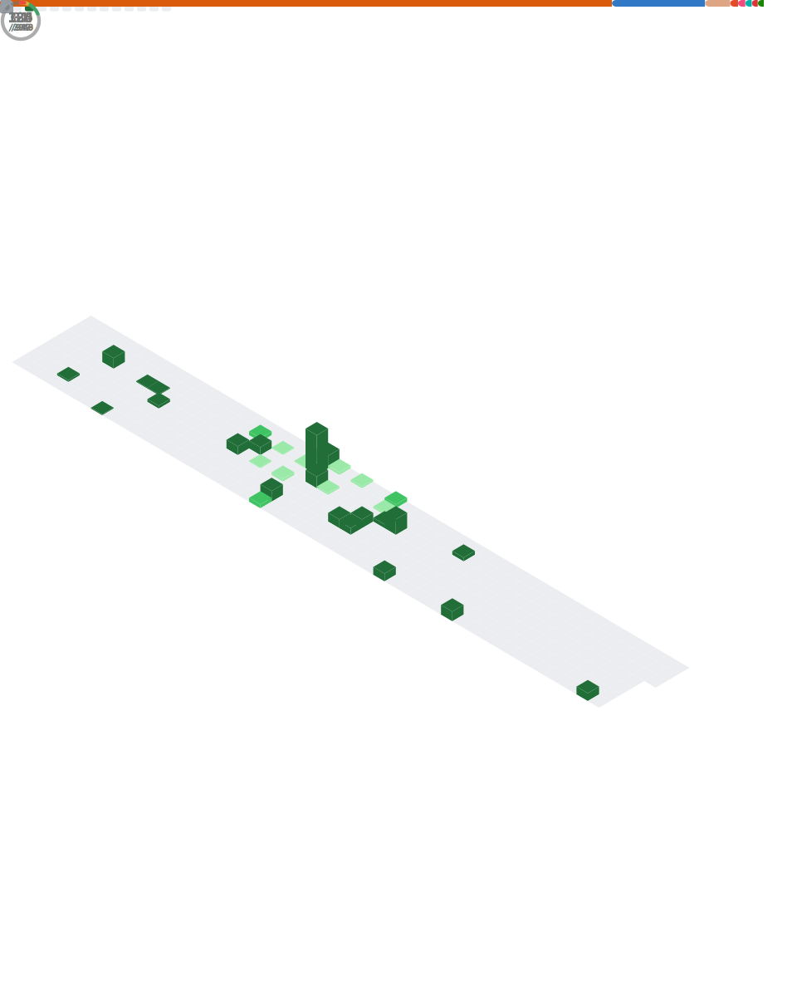

# Jeet Karena

### Computer Engineer · Distributed Control Planes · Low-Latency Tooling

  
  
  
  
  

  
  
  
  

---

## ⚡ Select Engineering Work

### `zfish` — Cross-Platform CLI Runtime *(Rust)*

High-performance terminal application framework with zero external runtime dependencies. Engineered for minimal binary size, fast cold-start, and ergonomic API surface across Linux, Windows, and macOS.

**Performance & Design:**
- Static binaries `< 1 MB`
- Zero-copy I/O via `mmap` syscalls
- Work-stealing async scheduler
- ANSI / true-color terminal support
- Modular component system (prompts, tables, progress bars)

### `Hybrid K8s Mesh` — Multi-Cloud Control Plane *(AWS EKS ↔ Azure AKS)*

Terraform-driven Infrastructure-as-Code topology with GitOps workflows and zero-trust Cilium networking. Built for resilient cross-cluster service routing and automated disaster recovery.

**Scale & Reliability:**
- `40+` nodes across multi-cloud regions
- `< 30 s` automated failover RTO
- `15+` cross-region services in active-active mesh
- Zero-trust network policies (Cilium + eBPF)

### `Home Lab Cluster` — Bare-Metal vSphere Hypervisor

Production-parity environment for control-plane chaos engineering. Full observability pipeline: OpenTelemetry → Prometheus → Grafana.

---

## 🛠️ Technical Vector

| Domain | Tools |
|--------|-------|
| **Systems Languages** | Rust, C++, C, Python, TypeScript |
| **Control Plane** | Kubernetes (EKS / AKS), Docker, VMware vSphere, Linux (Debian / RHEL) |
| **Communication** | gRPC, REST, WebSockets |
| **Storage & Caching** | PostgreSQL, Redis, MongoDB |
| **Infrastructure** | Terraform, Ansible, GitHub Actions, Jenkins |
| **Observability** | OpenTelemetry, Prometheus, Grafana, Distributed Tracing |
| **Tooling** | VS Code, Vim, Bash |

---

## 📊 Live Telemetry

  
  

---

## 🤝 Connect

- **Professional:** [linkedin.com/in/jeetkarena01](https://linkedin.com/in/jeetkarena01)
- **Code:** [github.com/JeetKarena](https://github.com/JeetKarena)
- **Q&A:** [StackOverflow](https://stackoverflow.com/users/20814451)
- **Algorithms:** [leetcode.com/jeetkarena3](https://leetcode.com/jeetkarena3)
- **Secure:** `karenajeet@proton.me`
